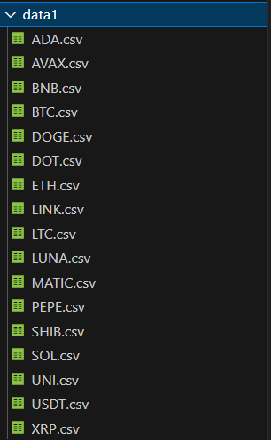
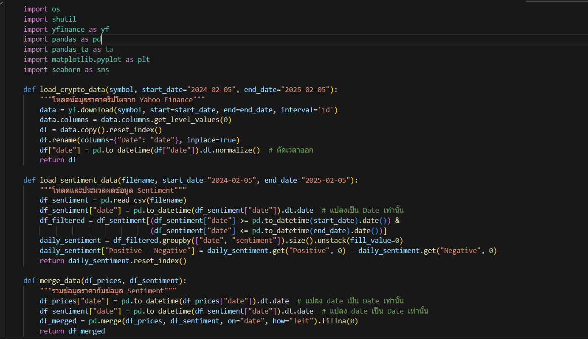
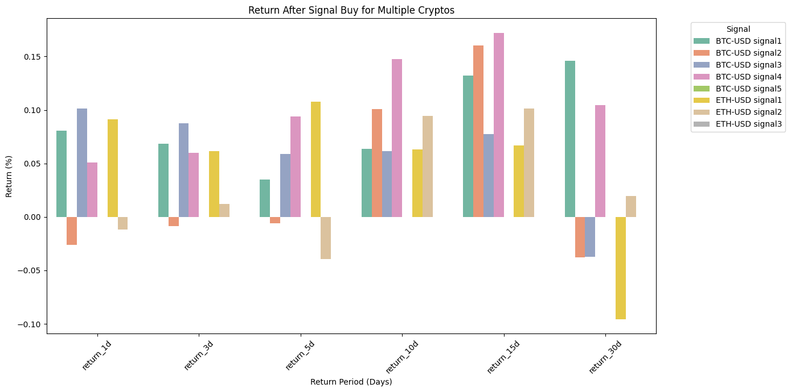

  

- ทำการเลือกเหรียญที่มีไฟล์ sentiment หนักสุด 17 เหรียญ จาก 2984เหรียญ

  

- ฟังก์ชั่น ต่างๆในการ implement sentiment

- 

  

- output จาก ฟังก์ชั่น จะเห็นว่ามีแค่ 2 เหรียญ ที่เกิดsignal จากทั้งหมด17 เหรียญ อาจจะเกิดจากการตั้ง เส้นอ้างอิงที่ -30 ที่อาจจะมากเกินไปสำหรับเหรียญที่มีข่าวไม่แรง

